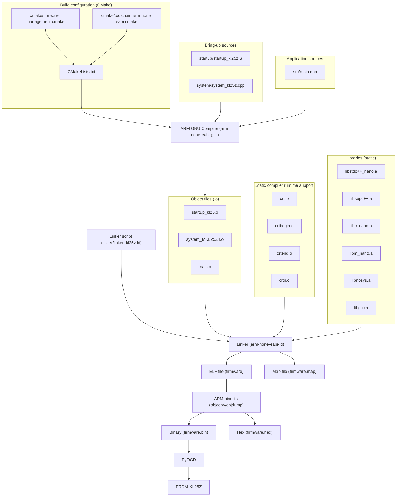
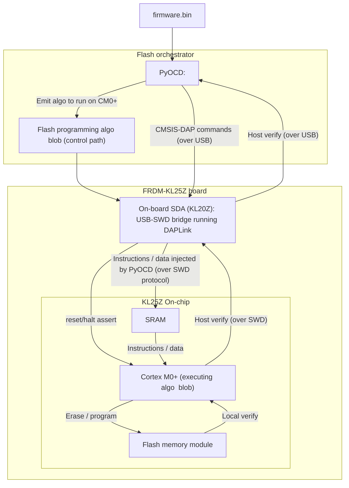
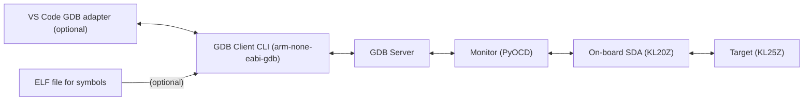

# Minimal Build for FRDM-KL25Z


A reproducible, minimal, open-source bring-up pipeline for the FRDM-KL25Z.

This project implements a fully reproducible bare-metal bring-up targeting the Cortex-M0+ core (ARMv6-M). Technical highlights:
- Cross-compiled with GCC for the ARM Cortex-M0+ core.
- Custom linker script defining the KL25Z memory layout.
- Bare-metal startup code and vector table.
- Automatic post-link firmware verification through ELF analysis.
- Debug-ready via pyOCD and GDB.
- Fully reproducible builds through CMake and containerization.
- Comprehensive documentation of each component.


## Direct Links
- [Project Purpose](#project-purpose)
- [Requirements](#requirements)
- [Development Milestones](#development-milestones)
- [Build Pipeline](#build-pipeline)
- [Hardware and Software Setup](#hardware-preparation)
- [Implementation Details](#linker-script-implementation)
- [Verification and Debugging](#verification-implementation)
- [Documentation and References](#documentation-and-references)
- [Appendices](#appendix-1-terminology)


## Project Purpose
#### Why does this project exist?
- To serve as a reference firmware build for embedded engineers.
- To make it easier to understand, reproduce, and verify each step required to bring up a microcontroller.
- To distill the build and bring-up to a minimal configuration, using open-source tools.

#### What does this project aim to advance in the embedded space?
- _Unified documentation_: End-to-end bring-up knowledge is fragmented across vendor manuals, CMSIS headers, and toolchain docs. This project consolidates the essential steps in one place.
- _Code minimalism_: Typical vendor SDKs introduce excessive abstraction and code bloat. For the KL25Z, the MCUXpresso SDK v2.2 produces ~35 MB of files for a “hello world.” This project achieves the same bring-up in kilobytes.
- _Open source toolchains_: Many MCU workflows rely on proprietary compilers, debuggers, or bootloaders (e.g., Keil MDK, PEMicro). This project uses a completely open stack: GCC, pyOCD, GDB, and CMake.
- _IDE independence_: Replaces IDE-centric workflows with reproducible command-line builds and minimal configuration overhead. That's suitable for CI and containerized development.

#### Why use FRDM-KL25Z for the project?
The FRDM-KL25Z is a dev/eval board from NXP with on-board OpenSDA. It's ideal for experimentation, and it's low cost.

| Spec              | Details                                                                                       |
|-------------------|-----------------------------------------------------------------------------------------------|
| **MCU**           | KL25Z with ARM Cortex-M0+ core (ARMv6-M architecture)                                         |
| **Core**          | Simple 32-bit core, uses Thumb-1 16-bit instructions (common in low-end and legacy devices)   |
| **Memory**        | 128 KB flash, 16 KB SRAM on-chip                                                              |
| **Peripherals**   | Basic on-chip peripherals (GPIO, UART, SPI, I2C, ADC, etc.)                                   |
| **Flash & Debug** | On-board OpenSDA makes it easy to flash and debug without additional hardware                 |
| **Extras**        | RGB LED, accelerometer, capacitive touch input                                                |
| **Part no.**      | NXP (originally Freescale) part no. MKL25Z128VLK4                                             |
| **EOL?**          | No, still in production as of October 2025                                                    |

#### FAQ
| Q                                             | A                                                                                                                                         |
|-----------------------------------------------|-------------------------------------------------------------------------------------------------------------------------------------------|
| Will the project work on my computer?         | It should work. It builds cross-platform in a devcontainer (Docker), and also natively on macOS (Apple silicon).                          |
| Will the project work with another devboard?  | Not directly, but once you understand the steps, the project can be adapted to another board and MCU.                                     |
| Is this all?                                  | No, this is the starting point. Real bring-up is a deep rabbit hole covering ARM architecture, ABI compliance, C/C++ runtime semantics, and debugging infrastructure. |


## Requirements

#### Non-functional (quality) requirements
- Reproducible: Builds entirely with open-source toolchains and CMake, portable across systems, and fully documented.
- Verifiable: Post-build scripts inspect and verify ELF artifacts.
- Scalable: Structured to support larger applications without rewriting startup, linker, or build infrastructure.
- Modern: Leverages modern CMake practices and the latest C++ standards supported by the Arm GNU toolchain.
- Validated: Boots, initializes the runtime environment, and hands off control to an interrupt-driven blinky application.

#### Functional requirements

| ID    | Requirement                                   | Module / Artifact                     | Progress      | Comments                              |
|------:|:----------------------------------------------|---------------------------------------|---------------|---------------------------------------|
| 1.1   | Implement build generator for Cortex-M0+      | CMakeLists.txt                        | Completed     | Ninja                                 |
| 1.2   | Provide cross-compiler toolchain              | cmake/toolchain-arm-none-eabi.cmake   | Completed     | Arm GNU Toolchain 14.2.rel1           |
| 1.3   | Integrate post-compile verification targets   | cmake/firmware_management.cmake       | In progress   | Targets for Req. 7.1-7.3              |
| 1.4   | Integrate pyOCD flashing and GDB debug targets|                                       | Planned       | PyOCD, GDB                            |
|       | <!-- spacer -->                               |                                       |               |                                       |
| 2.1   | Implement linker script for Cortex-M0+        | linker/linker_kl25z.ld                | Completed     | GNU ld                                |
|       | <!-- spacer -->                               |                                       |               |                                       |
| 3.1   | Implement startup code for Cortex-M0+         | startup/startup_kl25z.S               | Completed     | ARMv6-M Thumb-1                       |
|       | <!-- spacer -->                               |                                       |               |                                       |
| 4.1   | Implement system init for Cortex-M0+          | system/system_kl25z.cpp               | Planned       | MCG, OSC, SIM                         |
|       | <!-- spacer -->                               |                                       |               |                                       |
| 5.1   | Evaluate CMSIS header inclusion or minimal HAL| TBD                                   | Planned       |                                       |
|       | <!-- spacer -->                               |                                       |               |                                       |
| 6.1   | Implement minimal user application            | src/main.cpp                          | Planned       | C++20 / C++23                         |
|       | <!-- spacer -->                               |                                       |               |                                       |
| 7.1   | Provide firmware verification process         | -                                     | Completed     | See Req. 1.3 for build integration    |
| 7.2   | Implement manual inspection steps for ELF     | Check post-compile output             | Completed     |                                       |
| 7.3   | Implement automatic verification of ELF       | verify/test_firmware.py               | Completed     | Pytest, pyelftools                    |
|       | <!-- spacer -->                               |                                       |               |                                       |
| 8.1   | Provide project README and documentation      | README.md (this file)                 | Completed     | Compiled                              |
| 8.2   | Collect primary source documentation          | docs/primary_documentation/           | Completed     | Arm, NXP                              |
| 8.3   | Provide project documentation                 | docs/README_template.md               | In progress   | Req. 8.5 to build                     |
| 8.4   | Provide key diagrams                          | docs/diagrams/*.mmd, *.md             | In progress   | Mermaid, md                           |
| 8.5   | Provide README renderer script                | cmake/render_readme.cmake, readme_docs.cmake | Completed     | CMake                                 |
|       | <!-- spacer -->                               |                                       |               |                                       |
| 9.1   | Containerize project for portability          | .docker, .devcontainer                | Completed     | Multi-arch (amd64, arm64)             |
|       | <!-- spacer -->                               |                                       |               |                                       |
| 10.1  | Implement Continuous Integration              | .github/workflows                     | Completed     | GitHub Actions build/verify workflow  |


## Development Milestones

##### Week 1
- Add `SystemInit()` and clock configuration.
- Implement a minimal main.cpp:
    - Initialize GPIO clock for PTB18/PTB19 (red/green LEDs).
    - Configure SysTick (System Timer) for 1 kHz ticks.
	- Toggle one LED at 2 Hz in the SysTick ISR.

##### Week 2
- Add CMake target flash using pyocd flash $<TARGET_FILE:firmware>.
- Create a .gdbinit script with target remote, load, monitor reset halt, continue.
- Extend test_firmware.py:
    - Check Flash Config words (FSEC/FOPT) match your intended policy.

##### Week 3
- GitHub Actions workflow:
    - Upload .elf, .hex, .map, and size results as artifacts.
- Generate a markdown size/memory table appended to README.
- Add ninja clean target (optional).

##### Week 4
- Update README:
	- Add “Technical Highlights” block (toolchain, memory map, verification).
	- Show example build output (arm-none-eabi-size table).
    - Include screenshot/log proving LED or UART demo works.
- Explicitly document stance on CMSIS (“minimal by design” or “CMSIS-core only”).
- Tag repo v1.0 and write a short release note summarizing verification outcomes.

##### Other / future ideas
- QEMU
- Implement UART0 driver and send build ID over serial.
- Integrate unit tests for check_firmware.py using pytest.
- Add memory-use delta check to CI (fail build if footprint grows > 5%).
- Support secondary target (e.g., STM32L0) to show portability of your build core.


#### Other sources to read
- https://nicopinkowski.wordpress.com/fundamentals/
- https://github.com/npinkowski/tutorial_resources
- https://metebalci.com/blog/demystifying-arm-gnu-toolchain-specs-nano-and-nosys/
- https://embeddedartistry.com/blog/2019/04/17/exploring-startup-implementations-newlib-arm/


## Build Pipeline

The build pipeline is based on the ARM GNU Toolchain. 
Minimal components and build flow are detailed in the diagram.
Steps to obtain the build tools are described in the following section.

`CMakeLists.txt` declares how the project is to be built. 
The configuration in `cmake/toolchain-arm-none-eabi.cmake` is read early by CMake to choose compilers and set flags.

This project implements the sources for "bring-up" and "application", and the linker script.

<!-- BEGIN DIAGRAM -->
```Figure 1: Build pipeline```

<!-- END DIAGRAM -->


## Hardware Preparation

#### DAPLink (CMSIS-DAP debug probe interface)
- Replace stock PEMicro closed-source bootloader + interface.
- Download DAPLink firmware file v0253 from [daplink.io](https://daplink.io/).
- Connect the board in bootloader/maintenance mode (hold reset and plug in OpenSDA port).
- Best done in Linux: Mount device and copy file onto the FAT16 partition.
    - On Linux: `cp 0253_k20dx_frdmkl25z_0x8000.bin /path-to-mount/BOOTLOADER/ && sync`.
- Power cycle board. It should show up as a USB MSD named DAPLink.


## Software Preparation
The project has a VS Code devcontainer. That is the easiest way, if you have VS Code and Docker.
The underlying containers are [here](https://github.com/janusboandersen?tab=packages).

For a native build, get the following:

#### CMake
- Build-system generator.
- Install using package manager.
    - On macOS: `brew install cmake`.

#### Arm GNU Toolchain
- Compilers, linkers, runtime libraries, disassembler, etc.
- Download directly from [Arm Developer](https://developer.arm.com/Tools%20and%20Software/GNU%20Toolchain), or
- Install using package manager.
    - On macOS: `brew install --cask gcc-arm-embedded`.
- Make sure to have binaries in path. 
    - On macOS/Linux update your rc-file with `export PATH=/Applications/ArmGNUToolchain/14.3.rel1/arm-none-eabi/bin:$PATH`, or similar.

#### Pipx
- Package manager for Python CLI apps.
- Install using package manager.
    - On macOS: `brew install pipx`, `pipx ensurepath`.

#### PyOCD
- Communicate with CMSIS-DAP to flash and debug MCU. Provides GDB server support.
- Easiest way to install is your Python package manager. 
    - On macOS: `pipx install pyocd`.
- Plug in board and check that it enumerates the debug probes: `pyocd list --probes`.
- Confirm that PyOCD has built-in target support: `pyocd list --targets | grep -i kl25`.
- FYI, the OpenSDA chip is Kinetis K-series K20DX128VFM5.

#### Pyelftools
- Inspect and test ELF via Python3.
- Install in local environment via Python package manager.
    - On macOS: `python3 -m venv .pyenv`, `source .pyenv/bin/activate`, `python3 -m pip install pyelftools`.

#### Useful VS Code extensions:
- C/C++ Tool (`ms-vscode.cpptools`).
- CMake Tools (`ms-vscode.cmake-tools`).
- Cortex-Debug (`marus25.cortex-debug`).
- LinkerScript (`zixuanwang.linkerscript`)


## Linker Script Implementation

The implemented linker script is `linker/kl25z.ld`.

The goals of the linker script:
1) Direct `arm-none-eabi-ld` to output an ELF containing all relevant elements: code, data and symbols from all object files.
2) Mark elements appropriately for a complete memory layout map; ordering and placement in memory, access specifiers, boundaries.
3) Fulfill symbol/ABI contracts with linked libraries: Ingest their emitted symbols, and provide symbols they need.
4) Fulfill symbol/ABI contract with startup code: Same, but this project defines needed symbols.
4) Resolve all symbols into physical addresses.

**Appendix 2** contains a mini reference for the required linker script concepts and syntax.

#### Physical memory
ARMv6-M has a 32-bit address space and word size is 32-bit / 4-byte.
Memory is byte-addressable. 
So each consecutive address refers to a byte in memory. Byte order is little-endian.

On-chip physical memory is as below (**RefMan** pp. 105-106):

| Memory    | From Address  | To Address    | Size          |
|-----------|---------------|---------------|---------------|
| `FLASH`   | `0x0000_0000` | `0x0001_FFFF` | 128 KB (1, 2) |
| Config    | `0x0000_0400` | `0x0000_040F` | 16 B (2)      |
| `SRAM_L`  | `0x1FFF_F000` | `0x1FFF_FFFF` | 4 KB   (3)    |
| `SRAM_U`  | `0x2000_0000` | `0x2000_2FFF` | 12 KB         |

- Note (1): Nonvolatile storage is `128 KB * 1024 B / KB = 131,072 B`. Each byte is addressable, so we need `(131,072)_base10 = (0x0002_0000)_base16` addresses. `0x2000` different addresses are implemented by the range `0x0000_0000` to `0x0001_FFFF`.
- Note (2): Flash config section at `0x0000_0400` (16 bytes) is reserved for setting security state (SEC bits), protection (FPROT) and boot options (FOPT).
- Note (3): SRAM used as contiguous block in the memory map, but implemented as two banks with different controllers.

#### Target SRAM memory layout (runtime)
During bring-up, the startup code (implemented in this project) can organize the SRAM, i.e. copy data from Flash, initialize memory, etc.

The KL25Z supports XIP, so it is not required to copy executable code from Flash to SRAM.

A standard runtime memory layout is shown in the diagram below. 
It is annotated with symbols demarkating memory regions used in the startup code. 
Consult the next section (and the script file) for an overview of symbols that are required by libraries.

<!-- BEGIN DIAGRAM -->
```
Figure 2: Target SRAM memory layout after bring-up
──────────────────────────────────────────────────────────────────────────────────────────────────────
   KL25Z SRAM (16 KB)                                    Physical Addr.    VMA Addr.      LMA Address
──────────────────────────────────────────────────────────────────────────────────────────────────────
   ┌──────────────────────────────────────────────────┐  0x1FFF_F000       __data_start   __etext
   │ .data                                            │
   │ - Statically allocated pre-init. variables       │
   │ - Copied from flash by startup                   │
   └──────────────────────────────────────────────────┘  <-                __data_end__
   ┌──────────────────────────────────────────────────┐  <-                __bss_start__
   │ .bss                                             │
   │ - Statically allocated uninit. variables         │
   │ - Cleared to 0 by startup code                   │
   └──────────────────────────────────────────────────┘  <-                __bss_end__
   ┌──────────────────────────────────────────────────┐  <-                __HeapBase
   │ .heap                                            │
   │ - Managed by malloc/new if dynamic memory used   │
   │ - Heap grows toward higher addr.                 │
   └──────────────────────────────────────────────────┘  <-                __HeapLimit
   ┌──────────────────────────────────────────────────┐ 
   │ Potentially unused space                         │
   └──────────────────────────────────────────────────┘              
   ┌──────────────────────────────────────────────────┐  <-                __StackLimit
   │ .stack                                           │
   │ - Local variables and function frames            │
   │ - 8-byte aligned for call convention             │
   │ - Stack grows toward lower addr.                 │
   └──────────────────────────────────────────────────┘ 0x2000_2FFF        __StackBase
──────────────────────────────────────────────────────────────────────────────────────────────────────
```
<!-- END DIAGRAM -->

#### Target Flash memory layout
The Flash binary contains executable instructions (XIP), read-only data, as well as what else is required to bring up the SRAM.
It also contains various constructs for runtime mechanics, which are outside the scope of this project.
The symbol and section contract is in the next section.

<!-- BEGIN DIAGRAM -->
```
Figure 3: Target Flash memory layout to send to device
────────────────────────────────────────────────────────────────────────────────────
    KL25Z FLASH (128 KB)                                Physical Addr.  LMA Address 
────────────────────────────────────────────────────────────────────────────────────
   ┌────────────────────────────────────────────────┐   0x0000_0000     __isr_vector
   │ Vector Table                                   │
   │   - Initial MSP (word 0)                       │
   │   - Reset_Handler (word 1)                     │
   │   - Exception handlers / IRQ vectors           │
   └────────────────────────────────────────────────┘
   ┌────────────────────────────────────────────────┐   0x0000_00400
   │ Flash configuration field                      │
   │   - Security flags (16B)                       │                        
   └────────────────────────────────────────────────┘   0x0000_00410
   ┌────────────────────────────────────────────────┐
   │ .text                                          │
   │   - Executable code (XIP)                      │
   └────────────────────────────────────────────────┘       
   ┌────────────────────────────────────────────────┐
   │ .rodata                                        │
   │   - Read-only constants, literals              │
   └────────────────────────────────────────────────┘
   ┌────────────────────────────────────────────────┐
   │ Various runtime mechanics                      │
   │   - EHABI32, C++ support                       │
   └────────────────────────────────────────────────┘
   ┌────────────────────────────────────────────────┐ <-                __etext
   │ .data                                          │
   │   - Copied -> SRAM at runtime                  │
   └────────────────────────────────────────────────┘
   ┌────────────────────────────────────────────────┐
   │ Unused / Reserved Flash                        │
   │   - Free space for future code                 │
   └────────────────────────────────────────────────┘   0x2000_2FFF                            
────────────────────────────────────────────────────────────────────────────────────
```
<!-- END DIAGRAM -->


#### ABI compatibility: Flow

<!-- BEGIN DIAGRAM -->
```
Figure 4: ABI contracts
────────────────────────────────────────────────────────────
    CONTRACT FLOW: CM0+ boot
────────────────────────────────────────────────────────────
   ┌────────────────────────────────────────────────────┐
   │ Cortex-M0+                                         │
   │  - Fetches SP, PC from 0x0000_0000                 │
   │  - Begins execution at Reset_Handler               │
   │  - Expects valid vector table in Flash             │
   └────────────────────────────────────────────────────┘
                    │
                    │  (requires)
                    ▼
   ┌────────────────────────────────────────────────────┐
   │ Linker Script (kl25z.ld)                           │
   │  - Defines FLASH & SRAM regions                    │
   │  - Places .isr_vector @ 0x0000_0000                │
   │  - Emits symbols: __StackTop, etc.                 │
   │  - Resolves all absolute addresses                 │
   └────────────────────────────────────────────────────┘
                    │
                    │  (startup reads symbols)
                    ▼
   ┌────────────────────────────────────────────────────┐
   │ Startup (Reset_Handler, startup_kl25z.S)           │
   │  - Copies .data from Flash to SRAM                 │
   │  - Zeros .bss                                      │
   │  - Initializes MSP, VTOR                           │
   │  - Calls SystemInit(), __libc_init_array(), main() │
   └────────────────────────────────────────────────────┘
                    │
                    │  (calls)
                    ▼
   ┌────────────────────────────────────────────────────┐
   │ C, C++ Runtime Libraries                           │
   │  - Provide __libc_init_array, _sbrk, malloc, etc.  │
   │  - Assume initialized .data/.bss and valid stack   │
   │  - Rely on linker-defined symbols for boundaries   │
   └────────────────────────────────────────────────────┘
                    │
                    │  (hands control to)
                    ▼
   ┌────────────────────────────────────────────────────┐
   │ User Application                                   │
   │  - Implements main()                               │
   │  - Runs on configured clock tree                   │
   │  - May call drivers, stdlib, or CMSIS APIs         │
   └────────────────────────────────────────────────────┘
────────────────────────────────────────────────────────────
```
<!-- END DIAGRAM -->

#### ABI compatibility: Expectations between linked objects

The table below is not exhaustive. Other libraries will likely require other symbols.

| Symbol/section            | Purpose                                   | Emitted by        | Excpected by                          |
|---------------------------|-------------------------------------------|-------------------|---------------------------------------|
| `.isr_vector`             | Vector table (MSP init., handlers)        | startup_kl25z.S   | kl25z.ld (place), CM0+ on reset (use) |
| `__isr_vector`            | Debuggable symbol pointing at vector tabl.| startup_kl25z.S   | kl25z.ld (place)                      |
| `.FlashConfig`            | Flash configuration (NXP specific)        | startup_kl25z.S   | kl25z.ld (place), Boot ROM (use)      |
| `__boot_marker`           | Debuggable magic value (0xA5A5A5A5)       | startup_kl25z.S   | kl25z.ld (place), Debugger (inspect)  |
| `SystemInit`              | Clocktree configuration, WDT, etc.        | system_MKL25Z4.cpp| startup_kl25z.S (to call)             |
| `__libc_init_array`       | Static object initialization              | libc              | startup_kl25z.S (to call)             |
| `main`                    | User application entrypoint               | main.cpp          | startup_kl25z.S (to call)             |
| `__libc_fini_array`       | Static object destruction                 | libc              | startup_kl25z.S (to call)             |
| `.text`                   | Executable code                           | TUs               | kl25z.ld (place and aggregate)        |
| `.rodata`                 | Read-only statically allocated data       | TUs               | kl25z.ld (place and aggregate)        |
| `.data`                   | Pre-initialized statically allocated data | TUs               | kl25z.ld (place and aggregate)        |
| `.bss`                    | Uninitialized statically allocated data   | TUs               | kl25z.ld (place and aggregate)        |
| `__StackTop`              | Location of stack base, initial MSP       | kl25z.ld          | startup_kl25z.S                       |
| `__etext`                 | LMA address of start of .data section     | kl25z.ld          | startup_kl25z.S                       |
| `.preinit_array`          | Funcs to run before static constructors   | TUs, crtbegin.o   | kl25z.ld (place and aggregate)        |
| `.init_array`             | C++ static constructors and initalizers   | TUs, crtbegin.o   | kl25z.ld (place and aggregate)        |
| `.fini_array`             | C++ static destructors and cleanup        | TUs, crtbegin.o   | kl25z.ld (place and aggregate)        |
| `__preinit_array_start`   | Begin boundary for function ptrs          | kl25z.ld          | libc (__libc_init_array())            |
| `__preinit_array_end`     | End   --                                  | kl25z.ld          | Same                                  |
| `__init_array_start`      | Begin boundary for constructor ptrs       | kl25z.ld          | libc (__libc_init_array())            |
| `__init_array_end`        | End   --                                  | kl25z.ld          | Same                                  |
| `__fini_array_start`      | Begin boundary for destructor ptrs        | kl25z.ld          | libc (__libc_fini_array())            |
| `__fini_array_end`        | End   --                                  | kl25z.ld          | Same                                  |
| `__end__`                 | Heap base symbol for malloc, etc.         | kl25z.ld          | libc, libc++                          |
| `end`                     | Heap base symbol for _sbrk                | kl25z.ld          | libnosys                              |
| `__HeapLimit`             | Heap end symbol                           | kl25z.ld          | convenience                           |
| `__heap_start__`          | Heap base symbol for CMSIS                | kl25z.ld          | CMSIS                                 |
| `__heap_end__`            | Heap end symbol for CMSIS                 | kl25z.ld          | CMSIS                                 |
| `__stack`                 | Stack base symbol for CMSIS (possible)    | kl25z.ld          | CMSIS                                 |
| `_estack`                 | Stack end symbol for CMSIS (possible)     | kl25z.ld          | CMSIS                                 |
| `__StackLimit`            | Stack end symbol for CMSIS (possible)     | kl25z.ld          | CMSIS                                 |
| `.ARM.extab`              | ARM EHABI32 stack unwinder tables         | Compiler          | kl25z.ld (place), unwinder (use)      |
| `.ARM.exidx`              | ARM EHABI32 stack unwinder indices        | Compiler          | kl25z.ld (place), unwinder (use)      |
| `__exidx_start`           | Begin boundary for indices                | kl25z.ld          | libgcc unwinder                       |
| `__exidx_end`             | End   --                                  | kl25z.ld          | libgcc unwinder                       |

See **Appendix 4** for an overview of the standards that build up the ABI requirements.


## Startup Code Implementation

**Appendix 3** contains a mini reference for the required assembler syntax.

The startup code is implemented in `startup/startup_kl25z.S`.

This code is analogous to a BIOS.
The actual role of the startup code was outlined in the previous sections; To define the vector table and the `Reset_Handler`, which in turn prepares SRAM, and handles the startup flow.
The file is similar in spirit to something like `crt0.o` for a Linux distributable.

#### Boot sequence and bring-up
- The boot sequence is described in RefMan 6.3.3.
- After the system is released from reset (power, default clocking, flash init), the CM0+ bootstraps itself by starting execution at word 1.
- Our provided startup code (Reset_Handler) is vectored at word 1, and will then run to prepare the right context in SRAM.

To bootstrap, the core needs a stack pointer (`SP`), program counter (`PC`) and link register (`LR`).
- `SP` and `PC` are read from offset `0x00` (word 0) and offset `0x04` (word 1) of the vector table, respectively.
- `LR` is init to `0xFFFF_FFFF`.
- Bootstrap is done, and startup code execution can begin; The core executes from initial `PC` location. 

Take-away: The handler at offset `0x04` is the true entry point of the firmware, because it runs immediately after the processor is bootstrapped. It is known as the `Reset_Handler`.


### Vector Table
The architecture fixes 16 system vectors / exceptions (words 0-15):
- Word 0 (at offset 0): Initial `SP` (or initial main stack pointer, MSP).
- Word 1 (at offset 4): Initial `PC` (or Reset_Handler).
- Subsequent 14 words are vectors for other internal exception handlers, e.g. HardFault, SysTick.

The architecture supports 32 external interrupts (IRQ0-IRQ31):
- Probably a good idea to keep the CMSIS naming for these interrupts.

Table structure:
- Table must hold internal exception handlers (vectors) and external exception vectors = interrupt handlers. In total 48 vectors of 4 bytes each = 192 bytes.
- The vector table is required in the boot sequence as outlined in earlier chapter.
- KL25Z implements vector table relocation, and ARMv6-M needs to know the location of the vector table, so
    - Place vector table starting at `0x0000_0000`, i.e. offset `0x00` of the internal flash.
    - Set entry in `VTOR`, holding the offset to the vector table (**ArchMan** B3.2.5, p. B3-231).
    - `VTOR` is at `0xE000ED08` (**ArchMan** B3.2.2, p. B3-228).


### Reset_Handler
The `Reset_Handler` (word 1 of the vector table -> vector at `0x04`) is invoked by the processor immediately after bootstrap.
- Copies Flash `.data` into SRAM `.data`
- Zeros SRAM `.bss`
- Sets `MSP=__StackTop`
- Sets up exception and interrupt handlers to an overwritable default
- Runs `SystemInit()` (clocks, watchdog, etc.)
- Calls runtime libraries
- Hands off to `main()`.


## System Initialization Implementation
To be done.


## Minimal HAL Implementation
To be done.


## User Application Implementation
To be done.


## Verification Implementation
To be done.

##### Verification: Checking the Flash configuration field
To be done.

##### Verification: Checking the magic word
To be done.

##### Verification: Checking the Reset_Handler instructions
To be done.

### Inspection of the ELF (req. 7.2, using req. 1.3)
| Activity                  | Command                                                       |
|---------------------------|---------------------------------------------------------------|
| View sections             | `arm-none-eabi-readelf -S build/firmware`                     |
| View headers              | `arm-none-eabi-readelf -l build/firmware`                     |
| View symbol addresses     | `arm-none-eabi-nm -n build/firmware`                          |
| View section LMA and VMA  | `arm-none-eabi-objdump -h build/firmware`                     |

nm -C demangled
disassemble

### Automated verification of the ELF (req. 7.3)
To be done


## Flashing and Debugging

### Source -> ELF/binary -> Hardware recap
The ELF (with symbols) and the firmware binary (no symbols) are the outputs of the build pipeline, as shown already in Figure 1.
The figure below recaps the build transformations done up to now.
The next sections cover flashing the binary to hardware and debugging on hardware.

<!-- BEGIN DIAGRAM Build transformations -->
```
Figure 5: Build transformations
────────────────────────────────────────────────────────────────
    BUILD CHAIN: Sources to device
────────────────────────────────────────────────────────────────
   ┌────────────────────────────────────────────────────────┐
   │ Source Files (.S/.c/.cpp)                              │   
   │  • Relocatable sections: .text, .data, .bss            │
   │  • No fixed addresses yet                              │
   └────────────────────────────────────────────────────────┘
                    │
                    │  arm-none-eabi-gcc / g++
                    ▼
   ┌────────────────────────────────────────────────────────┐
   │ Object Files (.o)                                      │
   │  • Each has local symbol table, relocations            │
   │  • Still no fixed memory mapping                       │
   └────────────────────────────────────────────────────────┘
                    │
                    │  arm-none-eabi-ld (via g++ -T kl25z.ld)
                    │  Uses linker script to assign addresses
                    ▼
   ┌────────────────────────────────────────────────────────┐
   │ Executable and Linkable Format (ELF)                   │
   │  • Absolute addresses resolved (via MEMORY + SECTIONS) │
   │  • Includes vector table, symbols                      │
   │  • Used for debugging and conversion                   │
   └────────────────────────────────────────────────────────┘
                    │
                    │  arm-none-eabi-objcopy
                    ▼
   ┌────────────────────────────────────────────────────────┐
   │ Binary / Hex Image (.bin/.hex)                         │
   │  • Flattened memory image (Flash layout only)          │
   │  • No symbol or relocation data                        │
   └────────────────────────────────────────────────────────┘
                    │
                    │  pyocd flash firmware.bin
                    ▼
   ┌────────────────────────────────────────────────────────┐
   │ Physical Flash on KL25Z                                │
   │  • At reset, core reads vector table                   │
   │  • Begins execution from Reset_Handler                 │
   │  - Hands off to main()                                 │
   └────────────────────────────────────────────────────────┘
────────────────────────────────────────────────────────────────
```
<!-- END DIAGRAM -->


### Flashing with PyOCD
To be done.

<!-- BEGIN DIAGRAM Flash Pipeline -->

<!-- END DIAGRAM -->


### Debugging with GDB
To be done.


<!-- BEGIN DIAGRAM Debug Pipeline -->

<!-- END DIAGRAM -->


##### Connecting to target with PyOCD
PyOCD is still beta, so the command language is still evolving. The below are valid for v0.39.

| PyOCD command                                                         | Explanation                                                       |
|-----------------------------------------------------------------------|-------------------------------------------------------------------|
| `pyocd gdb -t kl25z -O connect_mode=attach -O frequency=1000000`      | Attach to SDA and start GDB server (:port-no)                     |


##### Debugging with GDB
Commands with `monitor` are passed through to PyOCD, so need to be supported by it.

| GDB command                                                           | Explanation                                                       |
|-----------------------------------------------------------------------|-------------------------------------------------------------------|
| **Connection**                                                        |                                                                   |
| `arm-none-eabi-gdb`                                                   | Start GDB client (without symbols from ELF)                       |
| `target extended-remote :3333`                                        | Connect to GDB server on port :3333, takes control of debug probe |
| **Execution**                                                         |                                                                   |
| `monitor halt`                                                        | Halt execution                                                    |
| `monitor resume`                                                      | Resume execution                                                  |
| `continue`                                                            | GDB lets target resume execution. Blocks until Ctrl+C             |
| `monitor reset`                                                       | Reset target                                                      |
| `monitor reset halt`                                                  | Reset target and stay halted                                      |
| **Register inspection**                                               |                                                                   |
| `register info`                                                       | View all registers, refer to e.g. AAPCS32                         |
| **Breakpoints**                                                       |                                                                   |
| `info break`                                                          |                                                                   |
| `delete <n>`                                                          | Delete breakpoint n                                               |
| **Examine memory**                                                    |                                                                   |
| `x/NFU <address>`, `FU` in any order, `U` is optional                 | `N`=num units, `F`=format (i,x,d,b,...), `U`=u size (b,h,w,g,...) |
| `x/32i <address>`                                                     | Inspect code: Examine 32 instructions starting from <address>     |
| `x/8xw <address>`                                                     | Inspect data: Examine 8 words (32-bit) as raw data                |


## Documentation and References
#### Documentation for the hardware
- NXP: Covers the integrated peripherals (memory, timers, etc.), chip electrical characteristics, dev board.
    - Kinetis KL25 Sub-Family Reference Manual (KL25P80M48SF0RM.pdf), Rev. 3 (2012) aka. **RM** or **RefMan**.
    - Kinetis KL25 Sub-Family Technical Data Sheet (KL25P80M48SF0.pdf).
    - FRDM-KL25Z User's Manual (NXP_FRDM-KL25Z_UM.pdf).
- ARM. Covers CM0+ core it's peripherals (NVIC, etc.) and the entire v6-M architecture spec.
    - Cortex-M0+ Devices Generic User Guide (ARM DUI 0662B), Issue B (2012) aka. **GUG**
    - ARMv6-M Architecture Reference Manual (ARM DDI 0419E), Issue E (2018) aka. **ArchMan**

##### Note on documentation scope:
- NXP's reference manual covers memory-mapped peripherals, like with SIM, MCG, GPIO, TPM, etc.
- It omits details about core registers (e.g., VTOR, AIRCR, PRIMASK, CONTROL, NVIC_ISER). These belong to the ARM Cortex-M0+ architecture itself, not to NXP’s implementation.
- To understand startup, interrupt vectors, or register-level core control, check the ARMv6-M Architecture Reference Manual. Specifically sections B3.2 (System Control Block) and B3.2.5 (VTOR).

##### Rule of thumb:
- If the address starts with `0xE000_Exxx`, it’s ARM.
- If `0x0000_0000`, it's NXP's Flash.
- If `0x2000_0000`, it's NXP's SRAM.
- If `0x400x_xxxx`, it’s NXP's other peripherals.

#### Documentation for ARM ABI
- [2025Q1 release of ABI for the ARM Architecture](https://github.com/ARM-software/abi-aa/releases/tag/2025Q1), contains all current ARM ABI specs as PDFs.
- **AAPCS32**: Procedure call standard for the ARM architecture. [Defines register usage, argument passing, stack alignment].
- **BPABI32**: Base Platform ABI. [Defines ELF binary format conventions, standard sections, and runtime symbol contracts].
- **BSABI32**: Base Standard ABI. [Umbrella document linking AAPCS, BPABI, EHABI, and CPPABI specifications].
- **EHABI32**: Exception Handling ABI. [Defines unwind tables].
- **CPPABI32**: ARM C++ ABI. [Defines vtables, RTTI, constructor/destructor model, and exception interop].
- Canonical C++ language ABI: [Itanium C++ ABI](https://itanium-cxx-abi.github.io/cxx-abi/abi.html). [Defines name mangling, RTTI layout, and C++ runtime hooks, directed at compiler-vendors].
- **AAELF32**: ELF for the Arm Architecture. [Defines structure of an ELF and semantics of e.g. .ARM.attributes]

##### Notes on reading order:
Suggested to read "from hardware and up", after basic overview of ARMv6-M amd CM0+ core:
1) [mandatory] AAPCS32. Focus on calling conventions and argument passing, use of registers.
2) [mandatory] BPAPI32. Focus on binary objects, ELF section names, standard symbols for linking runtime.
3) [optional] Itanium C++ ABI. Focus on what a compiler could/should emit for C++ (constructors, vtables, exceptions).
4) [optional] AAELF32. Skim, and locate the Addenda32 references needed. Used for build verification.
5) [relevant for C++] EHABI32. Focus on how ARM implements exceptions and stack unwinding tables using `exidx` and `extab`.
6) [relavant for C++] CPPABI32. Focus on constructor/destructor model, vtables, name mangling.

#### Runtime libraries (C++ binary with -specs=nano.specs -lc -lm -lnosys)
- _GCC libstdc++_
    - `libstdc++_nano.a`: C++ runtime (new, delete, etc.), STL.
    - `libsupc++`: Itanium C++ ABI symbols.
- _[Newlib](https://sourceware.org/newlib/)_
    - `libc_nano.a`: 
        - C runtime (memcpy, malloc, etc.), 
        - C startup hooks (__libc_init_array(), __libc_fini_aray()),
    - `libm_nano.a`: math library.
    - `libnosys.a`: system call stubs
- _GCC libgcc_
    - `libgcc.a`: Compiler runtime (div/mod, unwinder)

#### Implementation references for inspiration
- SDK emitted from [MCUXpresso](http://mcuxpresso.nxp.com/);
    - CM0+ core structures: `core_cm0plus.h`.
    - CMSIS layer: ...
    - Startup file: `devices/MKL25Z4/gcc/startup_MKL25Z4.S`.
    - Linker scripts: `devices/MKL25Z4/gcc/MKL25Z128xxx4_flash.ld` and `devices/MKL25Z4/gcc/MKL25Z128xxx4_ram.ld`.
    - Board files: ... `.c`.
- Open source projects:
    - [libopencm3](https://github.com/libopencm3/libopencm3).
    - [baremetal](https://github.com/cortexm/baremetal).
    - [zero-to-main](https://github.com/memfault/zero-to-main).


# Appendix 1: Terminology

| Term                  | Explanation                                                       |
|-----------------------|-------------------------------------------------------------------|
| ABI                   | Application Binary Interface                                      |
| bss                   | Block Starting Symbol (statically allocated, no value assigned)   |
| CI                    | Continuous Integration                                            |
| CM0+                  | Cortex-M0+                                                        |
| CMSIS                 | Common Microcontroller Software Interface Standard                |
| DAP                   | Debug Access Port, in DAPLink and CMSIS-DAP                       |
| EABI                  | Embedded ABI                                                      |
| ELF                   | Executable and Linkable Format                                    |
| GAS                   | GNU Assembler (assembler dialect)                                 |
| GDB                   | GNU Debugger                                                      |
| ISA                   | Instruction Set Architecture                                      |
| ISR                   | Interrupt Service Routine                                         |
| LR                    | Link Register                                                     |
| LSB                   | Least Significant Bit                                             |
| MCU                   | Microcontroller Unit                                             |
| MSD                   | Mass Storage Device (USB device class)                            |
| MSP                   | Main Stack Pointer                                                |
| NVIC                  | Nested Vector Interrupt Controller                                |
| OCD                   | On-Chip Debugger (software)                                       |
| PC                    | Program Counter                                                   |
| SP                    | Stack Pointer                                                     |
| SDA                   | Serial Debug Adapter (hardware debug probe / circuitry)           |
| SDK                   | Software Development Kit                                          |
| SRAM                  | Static Random-Access Memory (volatile)                            |
| TU                    | Translation Unit                                                  |
| UAL                   | ARM syntax ~ ARM's Unified Assembler Language                     |
| XIP                   | Execution in Place                                                |


# Appendix 2: Linking - GNU Linker Script Reference Summary

GNU Linker script is [documented as part of binutils](https://sourceware.org/binutils/docs/).
A simplified outline of the linker script structure:
```
MEMORY
{
    FLASH (rx)  : ORIGIN = 0x00000000, LENGTH = 128K
    RAM   (rwx) : ORIGIN = 0x1FFFF000, LENGTH = 16K
}

/* Extra symbol definitions */

SECTIONS
{
    .isr_vector : { KEEP(*(.isr_vector)) } > FLASH
    .text       : { *(.text*) }            > FLASH
    .data       : { *(.data*) }            > RAM
}
```

The linker script takes `.o` object files as input, and produces a single `.elf` binary executable file as output.
- An _input section_ comes _from_ an object file.
- An _output section_ is what the linker produces inside the final ELF image.
- Each output section has two addresses:
    - [Flash Image] LMA -copy-> [SRAM Execution] VMA
    - **Load Memory Address** (LMA): Where a section is stored in nonvolatile memory (ELF metadata).
    - **Virtual Memory Address** (VMA) aka. execution address: Where a section resides/runs from at runtime. 
    - The linker stores both in the ELF. Our startup code copies the data LMA->VMA.

The key constructs in a linker file

| Construct     | Effect                                                                                |
|---------------|---------------------------------------------------------------------------------------|
| `MEMORY`      | Declare memory regions with r/w/x access flags                                        |
| `SECTIONS`    | Maps input sections from `.o` file to ouput memory layout.                            |
| `SEC > REG`   | Placement operator: Put _SEC_ in the specified memory _REG_, loc.ptr. moves into `REG`|
| `KEEP()`      | Prevents section from being garbage-collected by `--gc-sections`                      |
| `SORT()`      | Symbol-name based sort, e.g. for prioritized calls.                                   |
| `*(.text*)`   | Wildcard include: From all input files, include all sections that begin with `.text`  |
| `AT()`        | Sets LMA separately from VMA                                                          |
| `NOLOAD`      | Section to exist in RAM without image in Flash                                        |
| `PROVIDE()`   | Defines a symbol iff. not already defined elsewhere, globally visible and linkable    |
| `PROVIDE_HIDDEN()`   | Like `PROVIDE()`, but symbol is internal to ELF (not externally linkable)      |
| `.`           | Location pointer                                                                      |

The linker script only describes layout and symbol addresses.
Actual copying or zeroing of memory (for .data, .bss) is done by startup code, not the linker.


# Appendix 3: Startup and Assembler - GAS Assembler Reference Summary

The startup file defines processor entry points and minimal bring-up code for the KL25Z.
It is pure assembly and executes before any C runtime initialization.
Assembled using GAS directives and ARMv6-M thumb instructions.

An outlined startup script structure, to be filled with assembler code:
```
/* Preamble: Dialect, architecture, instruction set, instruction type */
.syntax unified
.arch armv6-m
.cpu cortex-m0plus
.thumb

/* Declaration of globals */

/* Vector table, 48 vector entries x 4-byte each */
.section .isr_vector, "a", %progbits
__isr_vector:
    /* Vectors... */

/* Flash cfg. field, 16 bytes */
.section .FlashConfig, "a", %progbits
    /* Bytes... */

/* Define Reset_Handler: entry point after reset */
.thumb_func
Reset_Handler:
    /* Function body... */
    /* Call SystemInit() */
    /* Copy data, bss */
    /* Call runtime library init */
    /* Call main() */

/* Define Default_Handler: no-op catch-all */
.thumb_func
Default_Handler:
    /* Function body... */

/* Set core exception vectors to weak (overwritable) */
/* Set interrupt vectors to weak (overwritable) */

/* Set core exception vectors to Default_Handler */
/* Set interrupt vectors to Default_Handler */

.end
```

##### Assembler preamble for CM0+ (ARMv6-M)
- GAS + UAL textual language and notation, e.g. for operand ordering.
- CM0+ decodes 16-bit Thumb-1 instructions (16-bit wide total for opcode and operands, with a few exceptions).
- Registers, ALU and data paths remain 32 bits wide.

##### GAS assembler syntax essentials
- **Directives (D)** start with a dot. Instructions to assembler or linker, or section names.
- **Pseudo-ops (P)** may also start with a dot, and expand to real instructions or data. Handled by GAS before linking, don’t exist in the final binary as instructions. 
- **Machine instructions (I)** assemble directly to binary opcodes. For CM0+, generally only 16-bit Thumb-1 instructions are valid (a few 32-bit Thumb-1 instructions like `bl`, no Thumb-2 or ARM mode). The core executes in little-endian mode.

##### Implications of 16-bit Thumb instructions and little-endian data layout
- Only "even" addresses in code space are fetchable/addressable (even = bit 0 is "0").
    - Instructions are aligned on 2-byte (half word) boundaries. So even addresses are the real instruction locations.
    - LSB on Cortex-M is the Thumb-state flag. "1" marks a callable thumb-mode function (as opposed to "0" marking ARM-mode, which is not supported on Cortex-M).
    - Example: A Reset_Handler linked at 0x0000_02A5 is actually a thumb function at 0x0000_02A4 (addr & 0xFFFF_FFFE)
    - Unaligned code access is an error.
- Odd addresses only make sense for byte access.
- Instructions generally only directly reference registers R0-R7 (ArchMan p. A4-62), i.e. registers `000` to `111`. They of course will internally access higher registers, e.g. the `PC`, `LR`, `SP` registers, etc.
- Instructions may not be longer than 16 bits in total.
- Example: `movs r0, 0x12` (instruction signature `movs Rd, #imm8`) fits in 16 bits -> Opcode is 5 bits (00100), register is 3 bits (000), and 8 bits remain for the immediate 0x12 (00010010).
- `ldr dest, =symbol` is a pseudo-op to load a register, but the symbol could be a constant yielding an instruction larger than 16 bits, so
    - Small constant: Loads the immediate if it fits within 16 bits. E.g. `ldr r0, =42` -> `movs r0, #42`.
    - Large constant: Emits expanded instruction with a literal pool, as the symbol doesn't fit. E.g. `ldr r0, =0x20000000` -> `ldr r0, [pc, #offset]` + `.word 0x20000000`.
- `.word 0x12345678` emits a 32-bit little-endian constant as the bytes `0x78 0x56 0x34 0x12`.

The full instruction set for ARMv6-M is described in ArchMan chapter A4.
The subset valid for CM0+ is listed in GUG chapter 3.
Below are the relevant ones for the startup file.

| Construct                 | Effect                                                                            |
|---------------------------|-----------------------------------------------------------------------------------|
| `.syntax unified`         | (D) Use unified ARM/Thumb syntax, operand format for ARMv6-M                      |
| `.arch armv6-m`           | (D) Assemble for ARMv6-M ISA. Only Cortex-M0/M0+ instructions                     |
| `.cpu cortex-m0plus`      | (D) Enable Cortex-M0+ instruction subset, Thumb-only core                         |
| `.thumb`                  | (D) Assemble Thumb instructions                                                   |
|`.section .name, "_"`      | (D) Create named section, flag in quoted string: none `""`, or `a`, `w` or `x`    |
| `"a"`                     | Allocatable means occupies space in memory, not allocatable means only in ELF     |
| `"w"`                     | Writable is for `.data` and `.bss` sections                                       |
| `"x"`                     | Executable is for `.text` section                                                 |
| `.align 2`                | (D) Align location counter to 2^2 = 4-byte boundary                               |
| `.text`                   | (D) Begin section of executable code                                              |
| `.globl`                  | (D) Export symbol so it's visible for other compilation units                     |
| `.weak`                   | (D) Declares symbol as weak, allowing user to override later                      |
| `.thumb_func`             | (D) Mark following symbol as function entrypoint on thumb architecture (low bit 1)|
| `.type symbol, %function` | (D) Mark `symbol` as a function in the ELF symbol table (callable, STT_FUNC)      |
| `.type symbol, %object`   | (D) Mark `symbol` as data object in the ELF symbol table (variable, array, STT_OBJECT)|
| `.size symbol, expr`      | (D) Record the size of `symbol` as `expr` in the ELF symbol table                 |
| `.word` / `.long`         | (P) Emit a 32-bit constant                                                        |
| `.set alias, target`      | (P) Define `alias` as alias for `target`, e.g. `IRQHandler` alias for `Default`   |
| `.end`                    | (D) Marks end of file, optional, ignored but improves readability                 |
| `N` flag                  | 1 iff op result was negative, otherwise 0                                         |
| `Z` flag                  | 1 iff op result was zero, otherwise 0                                             |
| `C` flag                  | 1 iff op resulted in carry (addition) or no-borrow (subtraction), otherwise 0     |
| `V` flag                  | 1 iff op caused overflow, otherwise 0                                             |
| `[Rn]`                    | Register indirect address: Use `Rn` as memory address, yields value @ address Rn  |
| `[Rn, #imm]`              | Register indirect with constant offset: Use `Rn + imm` as memory address          |
| `[Rn, Rm]`                | Register indirect with register offset: Use `Rn + Rm` as memory address           |
| `adds Rd, Rn, <Rm\|#imm`> | (I) Addition (upd NZCV flags): Rd <- (Rn + imm) or Rd <- (Rn + Rm)                |
| `ldr Rt, =symbol`         | (P) Load register: Rt <- immediate_symbol_or_literal_pool                         |
| `ldr Rt,[Rn]`             | (P) Load register: Rt <- [Rn]                                                     |
| `str Rt, [Rn, #imm]`      | (I) Store in register: memory[Rn + imm] <- Rt                                     |
| `movs Rd, #imm8`          | (I) Move immediate to register: Rd <- imm                                         |
| `cmp Rn, Rm`              | (I) Compare (upd NZCV flags): NZC <- (Rn - Rm). Alias for subs w/o storing        |
| `subs Rd, Rn, Rm`         | (I) Subtraction (upd NZCV flags): Rd <- (Rn - Rm) -> iff Rn >= Rm: no-borrow (C=1)|
| `b label`                 | (I) Branch unconditionally to label (PC => label_addr)                            |
| `b 4f`                    | (I) Branch unconditionally to label `4` ahead (suffix `f` means forward reference)|
| `b 4b`                    | (I) Branch unconditionally to label `4` back (suffix `b` means backward reference)|
| `bl label`                | (I) Branch unconditionally, link: LR <- PC and PC => label_addr                   |
| `blx Rm`                  | (I) Branch unconditionally, link, could chg. instr. set: LR <- PC, PC => Rm (chg.)|
| `bcc label`               | (I) Branch carry clear: PC => label_addr iff flag `C = 0`                         |
| `cpsid i`                 | (I) Disable interrupts, i.e. mask IRQs                                            |
| `cpsie i`                 | (I) Enable interrupts, i.e. unmask IRQs                                           |

(D) = Directive, (P) = Pseudo-op, (I) = Instruction.

`PC`: Program Counter, `LR`: Link Register.

Placeholders: `Rd` = Destination register, `Rt` = Transfer register, `Rn` = Base address register or first operand, `Rm` = Offset register or second operand, `Ra` = accumulator register.


# Appendix 4: ABI-specs

```
┌────────────────────────────────────────────────────────────────────────────┐
│  C/C++ Standard Libraries (newlib, newlib-nano, libstdc++, libc++)         │
│  ─────────────────────────────────────────────────────────────────────────  │
│  Implements:                                                               │
│   • __libc_init_array(), __libc_fini_array()                               │
│   • Global constructors/destructors (.init_array, .fini_array)             │
│   • Optional atexit() handlers, printf, malloc, etc.                       │
│   • Linker-provided boundaries:                                            │
│       __preinit_array_start / __preinit_array_end                          │
│       __init_array_start / __init_array_end                                │
│       __fini_array_start / __fini_array_end                                │
│                                                                            │
│  → Specification: newlib source / libstdc++ sources                        │
└────────────────────────────────────────────────────────────────────────────┘
                     ▲
                     │ uses
                     │
┌────────────────────────────────────────────────────────────────────────────┐
│  ARM C++ ABI (IHI 0043C) + Itanium C++ ABI                                 │
│  ─────────────────────────────────────────────────────────────────────────  │
│  Defines:                                                                  │
│   • C++ object model (vtable, RTTI, guard variables, mangling)             │
│   • Constructors / destructors ordering                                    │
│   • Section names:                                                         │
│       .preinit_array, .init_array, .fini_array                             │
│   • Function names:                                                        │
│       __cxa_atexit(), __dso_handle, __cxa_finalize(), etc.                 │
│                                                                            │
│  → Specification:                                                          │
│       - ARM IHI 0043C: C++ ABI for ARM Architecture                        │
│       - Itanium C++ ABI (base model, architecture-neutral)                 │
└────────────────────────────────────────────────────────────────────────────┘
                     ▲
                     │ relies on for call frames/unwinding
                     │
┌────────────────────────────────────────────────────────────────────────────┐
│  ARM Exception Handling ABI (EHABI, IHI 0036B)                             │
│  ─────────────────────────────────────────────────────────────────────────  │
│  Defines:                                                                  │
│   • Exception tables layout: .ARM.extab / .ARM.exidx                       │
│   • Symbols: __exidx_start / __exidx_end                                   │
│   • How unwinder walks stack frames and decodes compact unwind tables      │
│                                                                            │
│  → Specification: ARM IHI 0036B                                            │
└────────────────────────────────────────────────────────────────────────────┘
                     ▲
                     │ uses register/stack and data layout rules from
                     │
┌────────────────────────────────────────────────────────────────────────────┐
│  ARM Procedure Call Standard (AAPCS, IHI 0042E)                            │
│  ─────────────────────────────────────────────────────────────────────────  │
│  Defines:                                                                  │
│   • Function calling conventions (r0–r3 args, r0/r1 return)                │
│   • Stack alignment (8 bytes) and usage of SP, LR, PC                      │
│   • Section semantics: .text, .data, .bss, .rodata                         │
│   • Endianness and structure layout rules                                  │
│                                                                            │
│  → Specification: ARM IHI 0042E                                            │
└────────────────────────────────────────────────────────────────────────────┘
                     ▲
                     │ implemented by
                     │
┌────────────────────────────────────────────────────────────────────────────┐
│  Startup Code + Linker Script (Bare-metal / CMSIS)                         │
│  ─────────────────────────────────────────────────────────────────────────  │
│  Defines:                                                                  │
│   • __isr_vector, Reset_Handler                                            │
│   • SystemInit(), .data/.bss init, VTOR setup                              │
│   • MEMORY regions, load vs. virtual layout (LMA/VMA)                      │
│   • Section mapping to FLASH and SRAM                                      │
│                                                                            │
│  → Specification: CMSIS vendor packs + linker script conventions            │
└────────────────────────────────────────────────────────────────────────────┘
                     ▲
                     │
┌────────────────────────────────────────────────────────────────────────────┐
│  Hardware / CPU Core (ARMv6-M, ARMv7-M, etc.)                              │
│  ─────────────────────────────────────────────────────────────────────────  │
│  Defines:                                                                  │
│   • Register set, exception model, NVIC, VTOR, stack pointer behavior       │
│   • Endianness and memory map constraints                                  │
│                                                                            │
│  → Specification: ARM Architecture Reference Manual (ARMv6-M, DDI 0419E)   │
└────────────────────────────────────────────────────────────────────────────┘
```
